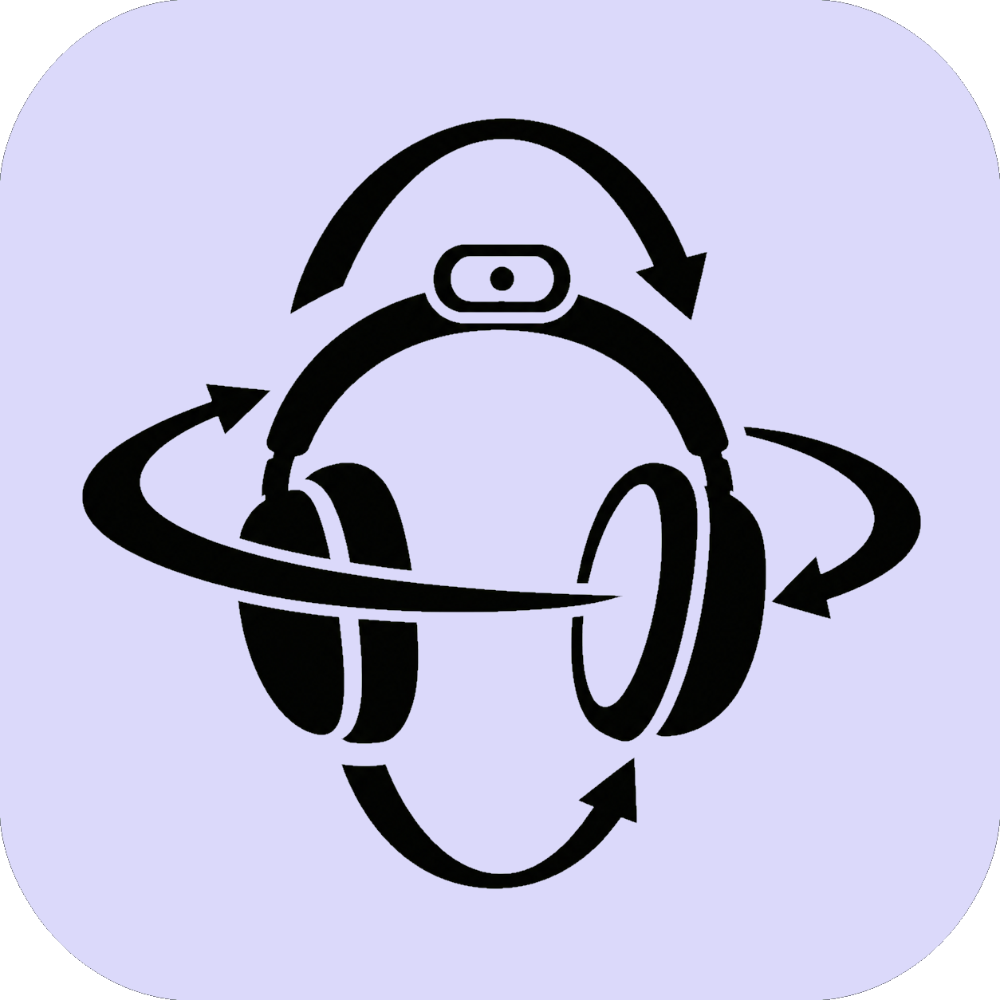

# Orienta



Orienta is a 3-DOF head-tracking application for Windows.
It reads accelerometer and gyroscope data from a serial-connected IMU, estimates
yaw, pitch, and roll with a complementary filter, and sends orientation data over UDP into opentrack.

## Why? 

The idea is to be able to track your head movements in games. Some huge names in the business are trackIR and Tobii, but their complete kits can be quite expensive, making the cost of entry into immersive simulation games quite high. 

While you can build your own kit, you would typically need an IR-sensitive camera with a high frame rate, carefully consider camera distance to head, design a clip for holding the 3 LEDs - it's possible, but can be tricky to get good results with. 

The space between these options is where Orienta could work for you. While there are some shortcomings to using an IMU, the arguments for it are compelling: You can build your own for probably under 15$, are completely free of any camera or viewing angle calculations, works the same wether your room is brightly lit or pitch black, and can track your head movements at over 120hz, giving you a buttery smooth experience. 

The only diy required is soldering up your sensor and your board and mounting it to your headset. Example included further below. 

## Features

- Real-time serial IMU acquisition with support for a wide range of sensors
- Quaternion-based complementary-filter implementation
- Gyro-bias calibration and correction
- Smooth autocentering when stationary and near center
- PyQt5 interface with light and dark themes.

## Installation

### Install script

`install.bat` creates a virtual environment, installs dependencies, and creates a desktop shortcut, if you so desire. 

### Manual installation

```powershell
git clone https://github.com/anmagx/Orienta
cd Orienta
python -m venv .venv
.venv\Scripts\activate
python -m pip install -r requirements.txt
python orienta.py
```

## Requirements

### Software

- Windows Operating System
- Python 3.8 through 3.14
- NumPy
- PySerial
- PyQt5
- Keyboard
- Pygame

### Hardware and serial format

Any device that emits numeric CSV values on a serial port is supported.
The bundled firmware is an Arduino Nano example using a FastIMU-supported
MPU6500, configured to run at 500000 baud. The sensor data must be structured as follows:

```text
time_milliseconds,accel_x,accel_y,accel_z,gyro_x,gyro_y,gyro_z
```

Accelerometer values are expected in g units and gyroscope values in degrees
per second. Configure the serial port and baud rate in the application to
match your device.

Magnetometers are currently not supported. 

## Usage

You will obviously need to find a way to mount your sensor on your head. In the example I use a 3D-printed case for the sensor itself and the arduino nano that both clip to my headset. Many, if not most IMUs will want to be mounted a specific up-direction to give accurate accelerometer readings - tilted on the side will probably not work, but flipped 180° is fine. The app allows for flipping axis in the preferences section. 

1. Flash the supplied Arduino sketch, or connect a compatible IMU source.
2. Select its serial port and baud rate, then start the serial reader.
3. Keep the device still and level while calibrating gyro bias.
4. Mount the device, reset orientation as needed, and enable UDP output.
5. Configure OpenTrack to receive UDP packets at the selected address and port.

Orienta always sends zero translation and orientation as yaw, pitch, and roll.

### User data

Preferences and logs are stored in `%LOCALAPPDATA%\Orienta`, for both source
and packaged executable runs. The directory is created automatically:

- `config.cfg` stores user preferences.
- `orienta.log` stores application logs; rotated logs remain in this directory.

If `LOCALAPPDATA` is unset, Orienta uses `AppData\Local\Orienta` under your home
directory. Existing project-local files are not migrated automatically. To keep
your previous settings, close Orienta and copy `config\config.cfg` to
`%LOCALAPPDATA%\Orienta\config.cfg` before launching the updated application.

## License

Orienta is distributed under the [MIT License](LICENSE).
